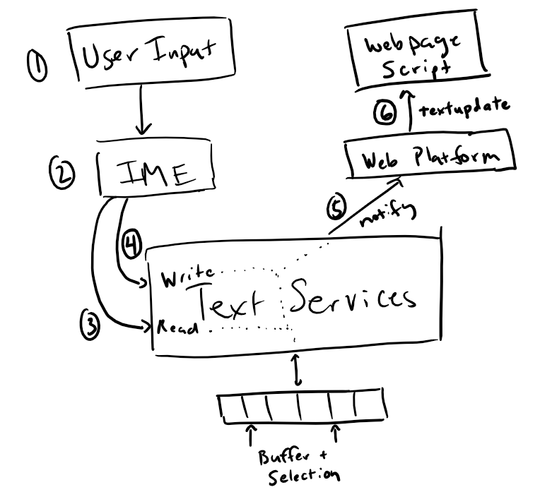
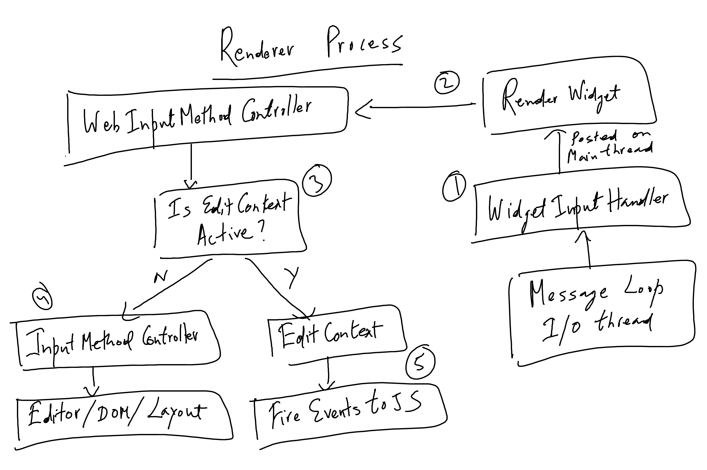
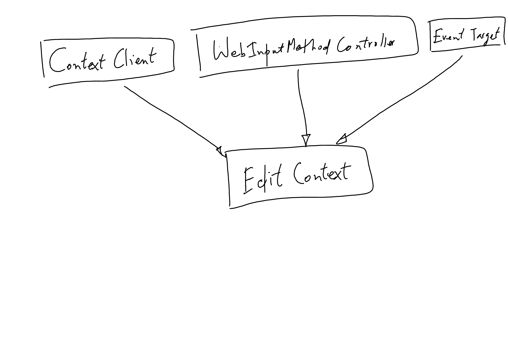
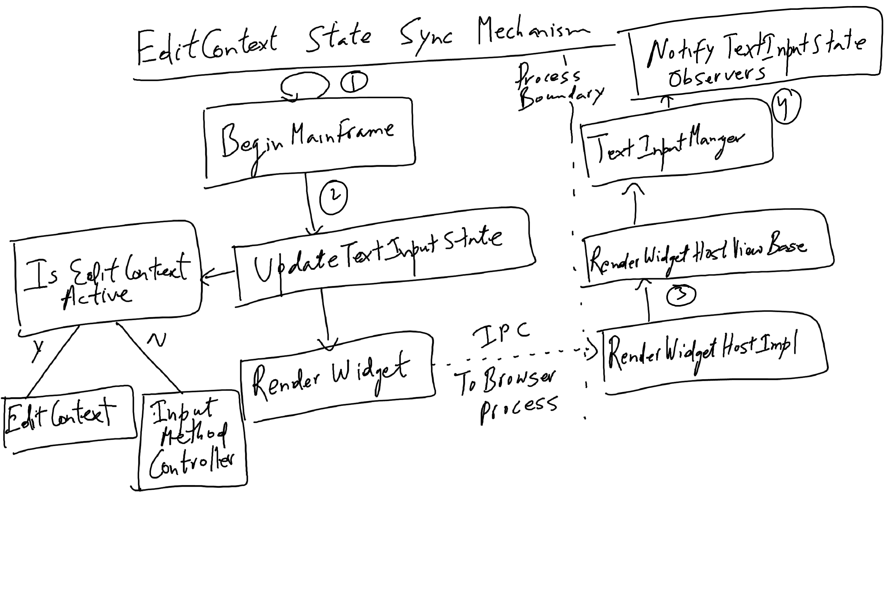

# Developer Design



1. The typical flow of text input comes from the user pressing keys on the keyboard. 
2. These are delivered to the browser, which opted-in to using the system's text services framework in order to integrate with the IMEs installed on the system. This will cause input to be forwarded to the active IME. 
3. The IME is then able to query the text services to read contextual information related to the underlying editable text in order to provide suggestions, and potentially modify which character(s) should be written to the shared buffer. 
4. These modifications are typically performed based on the current selection, which is also communicated through the text services framework. 
5. When the shared buffer is updated, the web application will be notified of this via the ```textupdate``` event.


This section describes the sequences of events that get fired on the EditContext and focused element when EditContext has focus and IME is active. In this event sequence, the user types in two characters, then commits to the first IME candidate by hitting 'Space'.

|  Event                | EventTarget        |  Related key in sequence
| -------------         | -----------------  | -------------------
|  keydown              | focused element    |  Key 1
|  compositionstart     | active EditContext |  ...
|  textupdate           | active EditContext |  ...
|  textformatupdate     | active EditContext |  ...
|  keyup                | focused element    |  ...
|  keydown              | focused element    |  Key 2
|  textupdate           | active EditContext |  ...
|  textformatupdate     | active EditContext |  ...
|  keyup                | focused element    |  ...
|  keydown              | focused element    |  Space
|  textupdate           | active EditContext |  (committed IME characters available in event.updateText)
|  keyup                | focused element    |  ...
|  compositionend       | active EditContext |

Note that the composition events are also not fired on the focused element as the composition is operating on the shared buffer that is represented by the EditContext.

### Externally triggered changes

Changes to the editable contents can also come from external events, such as collaboration scenarios. In this case, the web editing framework may get some XHR completion that notifies it of some pending collaboartive change that another user has committed. The framework is then responsible for writing to the shared buffer, via the ```updateText()``` method.


## API Details

```focus``` is used to activate an EditContext and a way to tell the OS that the author wants advanced text input methods enabled and that the metadata required for suggestions, where text input UI should appear, what the input mode is, etc. should all come from this particular editContext instance. This will create a strong reference (internally) from document to that editContext. The typical owner of an editContext instance will be the web app or widget that needs to enable text input.

```blur``` is used to deactivate an EditContext and it will also release the strong-ref by the Document. After calling blur, the EditContext instance won't receive any text input events from text input services.

The ```textupdate``` event will be fired on the EditContext when user input has resulted in characters being applied to the editable region. The event signals the fact that the software keyboard or IME updated the text (and as such that state is reflected in the shared buffer at the time the event is fired). This can be a single character update, in the case of typical typing scenarios, or multiple-character insertion based on the user changing composition candidates. Even though text updates are the results of the software keyboard modifying the buffer, the creator of the EditContext is ultimately responsible for keeping its underlying model up-to-date with the content that is being edited as well as telling the EditContext about such changes. These could get out of sync, for example, when updates to the editable content come in through other means (the backspace key is a canonical example &mdash; no ```textupdate``` is fired in this case, and the consumer of the EditContext should detect the keydown event and remove characters as appropriate).

Updates to the shared buffer driven by the webpage/javascript are performed by calling the ```updateText()``` method on the EditContext. ```updateText()``` accepts a range (start and end offsets over the underlying buffer) and the characters to insert at that range. ```updateText()``` should be called anytime the editable contents have been updated. However, in general this should be avoided during the firing of ```textupdate``` as it will result in a canceled composition.

```updateSelection()``` should be called by the web page in order to communicate whenever the selection has changed. It takes as parameters a start and end character offsets, which are based on the underlying flat text buffer held by the EditContext. This would need to be called in the event that a combination of control keys (e.g. Shift + Arrow) or mouse events result in a change to the selection on the edited document.

The ```updateLayout()``` method must be called whenever the [client coordinates](https://drafts.csswg.org/cssom-view/#dom-mouseevent-clientx) (i.e. relative to the origin of the viewport) of the view of the EditContext have changed. This includes if the viewport is scrolled or the position of the editable contents changes in response to other updates to the view. The arguments to this method describe a bounding box in client coordinates for both the editable region and also the current selection. The rectangles communicated through this API are used to scroll the EditContext into view when the software input panel gets raised by text input service or for IMEs to position the candidate window at the location where the composition is taking place.

The ```textformatupdate``` event is fired when the input method desires a specific region to be styled in a certain fashion, limited to the style properties that correspond with the properties that are exposed on TextFormatUpdateEvent (e.g. backgroundColor, textDecoration, etc.). The consumer of the EditContext should update their view accordingly to provide the user with visual feedback as prescribed by the software keyboard. Note that this may have accessibility implications, as the IME may not be aware of the color scheme of the editable contents (i.e. may be requesting blue highlight on text that was already blue).

```compositionstart``` and ```compositionend``` fire when IME composition begins and ends. It does not provide any other contextual information, as the ```textupdate``` events will let the application know the text that the user chose to insert.

There can be multiple EditContexts per document, and they each have a notion of focused state. Because there is no implicit representation of the EditContext in the HTML view, focus must be managed by the web developer, most likely by forwarding focus calls from the DOM element that contains the editable view. ```focus()``` and ```blur()``` APIs are used to set focus and blur on the EditContext respectively.

The ```inputMode``` property on the EditContext (also can be passed in a dictionary to the constructor) denotes what type of input the EditContext is associated with. This information is typically provided to the underlying system as a hint for which software keyboard to load (e.g. keyboard for phone numbers may be a numpad instead of the default keyboard). This defaults to 'text'.

```javascript
enum EditContextInputMode { "text", "decimal", "password", "search", "email", "numeric", "tel", "url" }
```

The ```enterKeyHint``` property on the EditContext (also can be passed in a dictionary to the constructor) denotes what type of Enter key action the EditContext is associated with. This information indicates to the text input services to display different glyphs for the enter key on the software input panel which also changes the functionality of the enter key such as enter to search, enter to send etc.

```javascript
enum EditContextEnterKeyHint { "enter", "done", "go", "next", "previous", "search", "send" }
```

The ```inputPolicy``` property on the EditContext (also can be passed in a dictionary to the constructor) denotes whether the virtual keyboard should be raised automatically or not when an EditContext is focused. It enables web authors to control the visibility of the VKs.

```javascript
enum EditContextInputPolicy { "auto", "manual" }
```

### Renderer process IME components:


1. WidgetInputHandlerImpl: Receives the IME messages in the IO thread and posts it to the main thread of the renderer process. 
2. It is then received by the RenderWidget that sends it to the WebInputMethodControllerImpl to decide which component should handle the IME event and fire the corresponding JS event.
3. WebInputMethodControllerImpl routes the IME events to the EditContext if there is an EditContext in focus, else it calls the InputMethodController APIs if the focused node is editable.
4. InputMethodController: A final class that is created using LocalFrame. This class has APIs to interact with DOM, selection controllers, “visible” range in the plain text view of the DOM, Editor etc. It also facilitates composition that is platform agnostic. It uses generic structure to represent the range of the selection, composed text (ImeTextSpan) etc.
5. If EditContext is in focus, then it updates the internal states and fires the corresponding events to JS.

### EditContext:


This class implements the WebInputMethodController interface and is also the event target for various JS events that get fired based on the IME and English typing events. The lifetime of the EditContext is managed by the Document. There can be multiple EditContext for an active document but only one can be focused at a time. The EditContext JS events are fired whenever there is an active composition. EditContext also maintains internal states that get updated during these input events. These internal states are used to communicate changes to the text input services that might affect their text view of the edit control.

### Synchronization mechanism


1. EditContext's state can be manipulated by either text input services or JS authors. This state is kept in sync with the text input services via TextInputState data object. This TextInputState object contains the data that is required by the text input services to synchronize their text view and provide meaningful suggestions and other text input intelligence operation.
2. The TextInputState object is updated on every lifecycle update(BeginMainFrame) which gets invoked right before the paint happens. This TextInputState object is updated from EditContext if it has focus, else, it is updated from InputMethodController and then sent by RenderWidget to the browser process through the IPC mechanism.
3. RenderWidgetHostImpl receives this IPC message in the browser process and forwards it to the TextInputManager via RenderWidgetHostViewBase which then notifies all the TextInputState observers.
4. The observers of the TextInputState object communicate with the text input services and synchronize the state.

#### Links to Relevant operating systems input APIs
| Operating System |    |
| ---------------- | -- |
| Android | [InputMethodManager](https://developer.android.com/reference/android/view/inputmethod/InputMethodManager) |
| OS X | [Implementing Text Input Support](https://developer.apple.com/library/archive/documentation/TextFonts/Conceptual/CocoaTextArchitecture/TextEditing/TextEditing.html#//apple_ref/doc/uid/TP40009459-CH3-SW25) |
| iOS | [Communicating with the Text Input System](https://developer.apple.com/library/archive/documentation/StringsTextFonts/Conceptual/TextAndWebiPhoneOS/LowerLevelText-HandlingTechnologies/LowerLevelText-HandlingTechnologies.html#//apple_ref/doc/uid/TP40009542-CH15-SW16) |
| Linux | [Intelligent Input Bus (IBus) ](https://github.com/ibus/ibus/wiki)
| Windows | [Text Services Framework](https://docs.microsoft.com/en-us/windows/desktop/TSF/text-services-framework) |